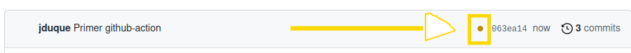
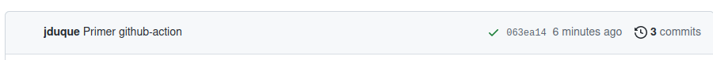

# Test_CI_CD [](https://github.com/JDM-ULL-93/Test_CI_CD/actions/workflows/SetUpEnv.yml)

En este tutorial se listaran los pasos para desplegar un entorno con CI y CD

## Continuos Integration

Este paso es bastante sencillo y se realiza mediante **Github Actions**.

### Creando el pipeline de despliegue

1. Creamos un fichero en .github/workflows/SetUpEnv.yml
```bash
    mkdir -p .github/workflows
    touch .github/workflows/SetUpEnv.yml
```
2. Vamos a crear un github action muy sencillo que solo va a mostrar por consola un "Hello World" para ver que el action se ejecuta correctamente:
```yml
    name: Hello World

    on:
        push:
            branches:
                - main
    jobs:
        hello_world:
            runs-on: ubuntu-latest
            steps:
                - name: Echo del mensaje.
                  run: echo "Hola Mundo!!!"
                -name: Muestra el contenido de la maquina.
                  run: ls -la
```
3. Lo subimos al repositorio y tendremos que ver el siguiente punto::

  

 Indicando que se esta ejecutando . Si todo se ha realizado correctamente, tendremos el siguiente "check verde" final:

 

 4. Vamos a complicar nuestro ejemplo.
    1. Como con el anterior action hemos podido ver que la maquina esta vacía, es indispensable traerse el repositorio. Podemos complicarlo y hacerlo a mano o ir por la via rápida y traernos el [action/checkout@v3](https://github.com/marketplace/actions/checkout). Para esto último, basta con añadir a **"steps"**:
    ```yml
        - name: Setup | Checkout
          uses: actions/checkout@v3
          with:
            fetch-depth: 0
    ```
    Con **fetch-depth** así indicamos que solo se traiga el último commit
    2. Ahora, lo que hace falta es preparar el entorno de nuestra maquina remota, esto es, instalar los binarios para la compilación en Rust. Nuevamente, para facilitarnos la vida, usaremos [ATiltedTree/setup-rust@v1](https://github.com/marketplace/actions/setup-rust):
    ```yaml
        - name: Setup | Rust
          uses: ATiltedTree/setup-rust@v1
          with:
            rust-version: stable
    ```
    3. Y ahora vamos a ejecutar el proceso de compilado y de ejecución de pruebas unitarias:
    ```yml
        - name: Build | Compile
        run: cargo build --verbose
        - name: Build | Tests
        run: cargo test --verbose
    ```
    Juntamos todas las piezas y la añadimos al final de "jobs":
    ```yml
    deploy_env:
        runs-on: ubuntu-latest
        steps:
        - name: Setup | Checkout
            uses: actions/checkout@v3
            with:
            fetch-depth: 0
        - name: Setup | Rust
            uses: ATiltedTree/setup-rust@v1
            with:
            rust-version: stable
        - name: Build | Compile
            run: cargo build --verbose
        - name: Build | Tests
            run: cargo test --verbose
    ```

### Desplegar 'Badge'

#### Github Action

El proceso para visualizar el Badge es bastante sencillo, basta con ir a **Actions** --> **Seleccionar action en la barra lateral izquierda** --> **Boton '...'** --> **Create status badge** --> **Copiar contenido**:


Y pegar todo ello en nuestro README.md